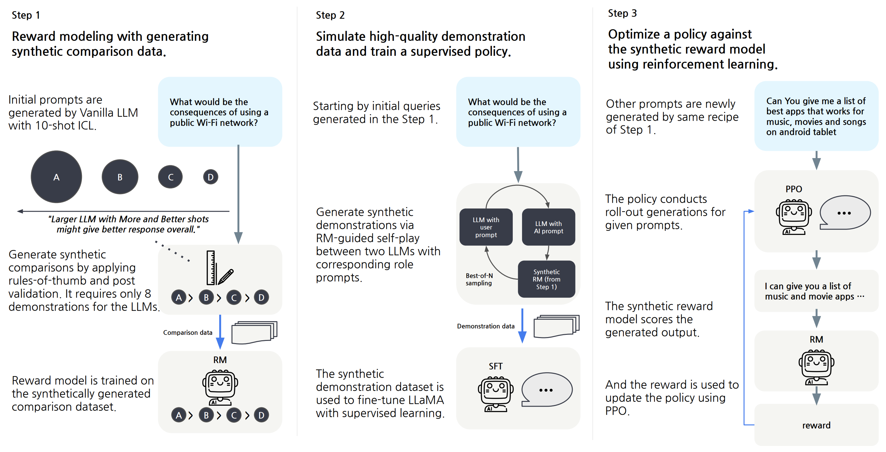

# ALMoST

This code is official implementation of "[Aligning Large Language Models through Synthetic Feedback](https://arxiv.org/abs/2305.13735)" accepted at EMNLP 2023.

<p align="center">
    
</p>

> **Abstract** Aligning large language models (LLMs) to human values has become increasingly important as it enables sophisticated steering of LLMs. However, it requires significant human demonstrations and feedback or distillation from proprietary LLMs such as ChatGPT. In this work, we propose a novel alignment learning framework with synthetic feedback not dependent on extensive human annotations and proprietary LLMs. First, we perform reward modeling (RM) with synthetic feedback by contrasting responses from vanilla LLMs with various sizes and prompts. Then, we use the RM to simulate high-quality demonstrations to train a supervised policy and further optimize the model with reinforcement learning. Our resulting model, Aligned Language Model with Synthetic Training dataset (ALMoST), outperforms recent open-sourced models, which are trained on the outputs of InstructGPT or human-annotated demonstrations, in alignment benchmarks. In human evaluation, our model is preferred to Alpaca and Dolly-v2, 55.0% and 58.5% of the time, respectively. Further analyses demonstrate the efficacy and importance of synthetic feedback in our framework.
 


## Citation

```bibtex
@inproceedings{kim2023aligning,
  title={Aligning Large Language Models through Synthetic Feedback},
  author={Kim, Sungdong and Bae, Sanghwan and Shin, Jamin and Kang, Soyoung and Kwak, Donghyun and Yoo, Kang Min and Seo, Minjoon},
  booktitle={EMNLP},
  year={2023}
}
```

## Setup

```
python -m venv almost
source almost/bin/activate
pip install -r requirements.txt
```


## Download Synthetic Datasets and Pre-trained Models

The synthetic datasets generated by this project are in `data/`. <br>

TBA: We will provide our data and models via Huggingface Dataset and Model.

## Generate own Synthetic Feedback (Comparions)

The synthetic feedback generation consists of the below three stages. <br>
Please specify one of available modes with `--mode=(pg|rg|cs)` option for each the step. <br><br>

To efficient generation, we employ [vllm](https://vllm.ai/) framework for inferences. <br>
You can disable the vllm with `--use_hf` option, but it makes this procedure slow. <br><br>

All output is saved in a directory specified with `--output_dir`.


### 1. Prompt Generation (PG)

We provide 100 general prompts as seed for this step in `assets/seed_prompts.txt`. <br>
You can define your own seed prompts with the following scheme. <br>
We assume the seed prompt file would be '.txt'. The first line of the file could be a specific instruction describing desired prompts. <br>
e.g., `### Instruction: Please generate initial query to start conversation with bot.`.


```
export OUTPUT_DIR=(str: Target directory path to save outputs)
export MODEL_NAME_OR_PATH=(str: Huggingface model for the generation)
export CACHE_DIR=(str: Cache directory for the Huggingface model)
export NUM_GENERATION=(int: The number of prompts to be sampled)


python synthetic_feedback.py \
  --mode pg \
  --prompt_file_path assets/seed_prompts.txt \
  --output_dir $OUTPUT_DIR \
  --model_name_or_path $MODEL_NAME_OR_PATH \
  --num_generation $NUM_GENERATION \
  --cache_dir $CACHE_DIR
```

It outputs `$OUTPUT_DIR/prompts.txt`


### 2. (Prompted-)Response Generation (RG)

For the generated prompts in `$OUTPUT_DIR/prompts.txt`, this step aims to generate assistants' responses according to various configurations.
You should specify the sampling configurations with the below three arguments.

- Model size: `$MODEL_NAME_OR_PATH` naturally indicates this factor.
- The number of demonstrations: `$N_SHOT` $\in \{1, 3, 5\}$
- The Quality of demonstration: `$PROMPT_FILE_PATH` would either `assets/HHH_prompt.txt` or `assets/Faithful_prompt.txt`.


```
export OUTPUT_DIR=(str: Target directory path to save outputs)
export MODEL_NAME_OR_PATH=(str: Huggingface model for the generation)
export PROMPT_FILE_PATH=(str: prompt file would either assets/HHH_prompt.txt or assets/Faithful_prompt.txt)
export N_SHOT=(int: The number of demonstrations)
export CACHE_DIR=(str: Cache directory for the Huggingface model)


python synthetic_feedback.py \
  --mode rg \
  --output_dir $OUTPUT_DIR \
  --model_name_or_path $MODEL_NAME_OR_PATH \
  --prompt_file_path $PROMPT_FILE_PATH \
  --n_shot $N_SHOT \
  --cache_dir $CACHE_DIR
```

### Bash script example

1. Llama-2-7b-HHH-1shot
2. Llama-2-7b-Faithful-3shot
3. Llama-2-13b-Faithful-3shot

```bash
export OUTPUT_DIR=(str: Target directory path to save outputs)
export CACHE_DIR=(str: Cache directory for the Huggingface model)

model_sizes=("meta-llama/Llama-2-7b-hf" "meta-llama/Llama-2-7b-hf" "meta-llama/Llama-2-13b-hf")
prompts=("assets/HHH_prompt.txt" "assets/Faithful_prompt.txt" "assets/Faithful_prompt.txt")
n_shots=(1 3 3)

for i in "${!model_sizes[@]}"
  model_name_or_path=${model_sizes[i]}
  promt_file_path=${prompts[i]}
  n_shot=${n_shots[i]}

  do
    python synthetic_feedback.py \
      --mode rg \
      --output_dir $OUTPUT_DIR \
      --model_name_or_path $model_name_or_path \
      --prompt_file_path $promt_file_path \
      --n_shot $n_shot \
      --cache_dir $CACHE_DIR
  done

```

This script produces three outputs

- `$OUTPUT_DIR/llama-2-13b-hf-Faithful-3shot.json`
- `$OUTPUT_DIR/llama-2-7b-hf-Faithful-3shot.json`
- `$OUTPUT_DIR/llama-2-7b-hf-HHH-3shot.json`


### 3. Construct Synthetic comparisons (CS)
Please remind that our rule-of-thumb for the syntheic feedback were <br>
1) Model size:
    Larger model > Smaller model

2) The number of demonstrations:
    More shots > Less shots

3) The quality of demonstrations:
    Better demonstration > Worse demonstration

You should specify desired ranking order of model configurations to `--rubric`. <br>
It should be descending order. <br>
For example, continue to the previous step, <br>

`--rubric llama-2-13b-hf-Faithful-3shot llama-2-7b-hf-Faithful-3shot llama-2-7b-hf-HHH-3shot`

might be right order according to the our rule-of-thumb. 


```
python synthetic_feedback.py \
  --mode cs \
  --output_dir $OUTPUT_DIR \
  --rubric llama-2-13b-hf-Faithful-3shot llama-2-7b-hf-Faithful-3shot llama-2-7b-hf-HHH-3shot
```

This script outputs the final binarized comparisons after adopting Heuristic Filteration (HF). <br>
The output will be located in `$OUTPUT_DIR/comparison.json`.


## Training Reward Model

<strong>NOTE</strong>: It requires a different environment setup! <br>
There is weird loss curve problem when we train models with FSDP in a specific version. <br>
Please see this [issue](https://github.com/tatsu-lab/stanford_alpaca/issues/298). <br>
We used the below environmental setup of original [Alpaca](https://github.com/tatsu-lab/stanford_alpaca) project when we trained our models. <br>
Please use this environment to reproduce our results.

```
python -m venv almost_train
source almost_train/bin/activate
pip install -r requirements-train.txt
```

We inherit the most code from [Alpaca](https://github.com/tatsu-lab/stanford_alpaca) project <br>
and train the 7B-sized model with 4 A100 80G GPUs in FSDP model. <br>
Please specify `--train_reward_model True` to train reward model.


```
MODEL_PATH=(str: Huggingface model to train. e.g., meta-llama/Llama-2-7b-hf)
DATA_PATH="data/almost_comparison.json" # (or your own synthetic feedback dataset)
OUTPUT_PATH=(str: Output directory to save model and outputs)
CACHE_DIR=(str: Huggingface cache directory path)
LR=2e-5
WEIGHT_DECAY=0.1
DECODER_LAYER='LlamaDecoderLayer'
MAX_LENGTH=1024
NUM_EPOCH=1

torchrun --nproc_per_node=4 --master_port=34321 train.py \
    --model_name_or_path $MODEL_PATH \
    --cache_dir $CACHE_DIR \
    --data_path $DATA_PATH \
    --bf16 True \
    --output_dir $OUTPUT_PATH \
    --num_train_epochs $NUM_EPOCH \
    --per_device_train_batch_size 4 \
    --per_device_eval_batch_size 4 \
    --gradient_accumulation_steps 8 \
    --gradient_checkpointing True \
    --evaluation_strategy "no" \
    --save_strategy "no" \
    --save_steps 2000 \
    --save_total_limit 1 \
    --learning_rate $LR \
    --weight_decay $WEIGHT_DECAY \
    --warmup_ratio 0.03 \
    --lr_scheduler_type "cosine" \
    --logging_steps 1 \
    --fsdp "full_shard auto_wrap" \
    --fsdp_transformer_layer_cls_to_wrap $DECODER_LAYER \
    --tf32 True \
    --model_max_length $MAX_LENGTH \
    --train_reward_model True
```

## RM-guided Self-Play (RMSP)

TBA

## Training SFT Model

Please use the same environmental setup of the Reward Model training.

```
source almost_train/bin/activate
```

```
MODEL_PATH="meta-llama/Llama-2-7b-hf"
DATA_PATH="data/almost_train.json"
OUTPUT_PATH="Output directory to save model and outputs"
CACHE_DIR="Huggingface cache directory path"
LR=2e-5
WEIGHT_DECAY=0.
DECODER_LAYER='LlamaDecoderLayer'
model_max_length=512
NUM_EPOCH=3

torchrun --nproc_per_node=4 --master_port=34321 train.py \
    --model_name_or_path $MODEL_PATH \
    --cache_dir $CACHE_DIR \
    --data_path $DATA_PATH \
    --bf16 True \
    --output_dir $OUTPUT_PATH \
    --num_train_epochs $NUM_EPOCH \
    --per_device_train_batch_size 2 \
    --per_device_eval_batch_size 4 \
    --gradient_accumulation_steps 8 \
    --gradient_checkpointing True \
    --evaluation_strategy "no" \
    --save_strategy "steps" \
    --save_steps 2000 \
    --save_total_limit 1 \
    --learning_rate $LR \
    --weight_decay $WEIGHT_DECAY \
    --warmup_ratio 0.03 \
    --lr_scheduler_type "cosine" \
    --logging_steps 1 \
    --fsdp "full_shard auto_wrap" \
    --fsdp_transformer_layer_cls_to_wrap $DECODER_LAYER \
    --tf32 True \
    --model_max_length $model_max_length
```


## RL Training

TBA: We will provide our RL code via [TRL](https://github.com/huggingface/trl) library instead [TRLX](https://github.com/CarperAI/trlx) we originally used.

## Evaluation

Please see [README.md](./eval/README.md) for the evaluation.

## License

```
Copyright (c) 2023-present NAVER Cloud Corp.

Licensed under the Apache License, Version 2.0 (the "License");
you may not use this file except in compliance with the License.
You may obtain a copy of the License at

    http://www.apache.org/licenses/LICENSE-2.0

Unless required by applicable law or agreed to in writing, software
distributed under the License is distributed on an "AS IS" BASIS,
WITHOUT WARRANTIES OR CONDITIONS OF ANY KIND, either express or implied.
See the License for the specific language governing permissions and
limitations under the License.
```
